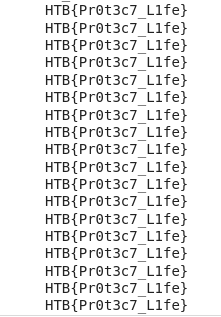

# On The Rescue Challenge Writeup by Om Honrao

## Challenge Description

```
The archeologist finally found the ancient vessel. Utilizing the alien technology he managed to breach in the central computational unit and learn the reason behind their visit on Earth millions of years ago. A message appeared. It was all a desperate plan for the survival of their kind.
```

## Attachments
```bash
- ml_on_the_rescue.zip
    ./architecture.py
    ./bigram_model.pt
```

## Solution
My first approach was to understand the attachments provided. I started with checking the [architecture.py](./architecture.py) file which had some code. It had a class `BigramLanguageModel` so i made quick search and found out that this was the file used to train a ML model.
```
The Bigram Model
This assumption that the probability of a word depends only on the previous word is also known as Markov assumption. Markov models are the class of probabilisitic models that assume that we can predict the probability of some future unit without looking too far in the past.
```
Hmm sounds interesting this model predicts words. Next we move on the [bigram_model.pt](./bigram_model.pt) file. The .pt made me think that this was a PyTorch model because it uses .pt extension. First thing came in my mind was this should be trained Bigram Model so there should be some way to load it and make it predict the words which in our case should be flag.
I did quick search and asked very new friend ChatGPT and made a script as follows:
```python
import torch
import random
import torch.nn as nn
from torch.nn import functional as F

class BigramLanguageModel(nn.Module):

    def __init__(self, vocab_size):
        super().__init__()
        self.token_embedding_table = nn.Embedding(vocab_size, vocab_size)

    def forward(self, idx, targets=None):

        logits = self.token_embedding_table(idx) 
        
        if targets is None:
            loss = None
        else:
            B, T, C = logits.shape
            logits = logits.view(B*T, C)
            targets = targets.view(B*T)
            loss = F.cross_entropy(logits, targets)

        return logits

# Load the pre-trained model
model_dict = torch.load('bigram_model.pt')
model_tensor = list(model_dict.values())[0]

# Define the vocabulary used by the model
vocab = list("0123456789abcdefghijklmnopqrstuvwxyzABCDEFGHIJKLMNOPQRSTUVWXYZ!#$%&'()*+,-./:;<=>?@[\]^_`{|}\n")

# Create a new instance of the BigramLanguageModel class
model = BigramLanguageModel(len(vocab))

# Initialize the embedding layer with the pre-trained tensor
with torch.no_grad():
    model.token_embedding_table.weight.copy_(model_tensor)

# Set the model to evaluation mode
model.eval()

# Use the model to generate text
text = ""
prev_token = random.choice(vocab)
while len(text) < 1000:
    with torch.no_grad():
        input_tensor = torch.LongTensor([[vocab.index(prev_token)]])
        output = model(input_tensor)
        logits = output[0, -1, :]
        probs = F.softmax(logits, dim=-1)
        prev_token = random.choices(vocab, weights=probs.tolist())[0]
        text += prev_token
print(text)
```
I wasn't having required lib's  and it was giving me error on my vm so one of my mate suggested using Colab.Therefore i ran the code on Google Colab and boom it outputs the flag!


## Flag
```
HTB{Pr0t3c7_L1fe}
```

## Contact info

This challenge was solved by Om Honrao (Discord ID: Inv1s1bl3#7047). If you have any questions or feedback, feel free to reach out to me.
