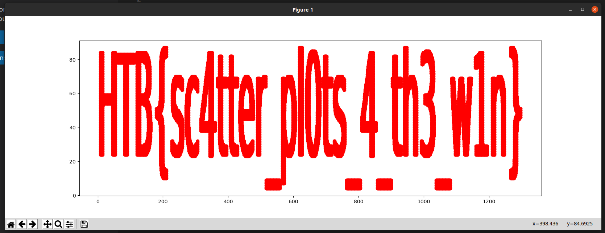

# Reconfiguration Challenge Writeup by Om Honrao

## Challenge Description

```
As Pandora set out on her quest to find the ancient alien relic, she knew that the journey would be treacherous. The desert was vast and unforgiving, and the harsh conditions would put her cyborg body to the test. Pandora started by collecting data about the temperature and humidity levels in the desert. She used a scatter plot in an Orange Workspace file to visualize this data and identified the areas where the temperature was highest and the humidity was lowest. Using this information, she reconfigured her sensors to better withstand the extreme heat and conserve water. But, a second look at the data revealed something otherwordly, it seems that the relic's presence beneath the surface has scarred the land in a very peculiar way, can you see it?
```

## Attachments
```bash
- ml_reconfiguration.zip
    - ./points.csv
    - ./analysis.ows
```

## Solution
My first approach was to understand the attachments provided. i started with checking the [analysis.ows](./analysis.ows) file which had some code. I honestly say i didn't get anything but i did figure out that it was somehow related to `Scatter Plotter` so i did a quick search on google and found a way, i got to know about `matplotlib` lib of python which can be used to plot points on a graph. 

Then i saw the [points.csv](./points.csv) file which had the coordinates of the points, but they are in scientific format so we need to convert it to integer so `matplotlib` can do its work.

Here is the exploit script i made:
```python
import matplotlib.pyplot as plt

# Read positions from file
with open('points.csv', 'r') as f:
    positions = f.readlines()

# Convert positions into two lists of x and y values
x_values = []
y_values = []

for pos in positions:
    x, y = pos.split(',')
    x_values.append(int(float(x)))
    y_values.append(int(float(y)))

print(len(x_values), len(y_values))

# Plot the points using matplotlib
plt.plot(x_values, y_values, 'ro')
plt.show()
```
This gave the following output which is the flag!



## Flag
```
HTB{sc4tter_pl0ts_4_th3_w1n}
```

## Contact info

This challenge was solved by Om Honrao (Discord ID: Inv1s1bl3#7047). If you have any questions or feedback, feel free to reach out to me.
